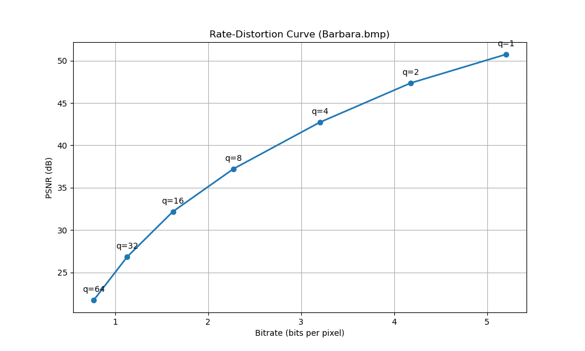
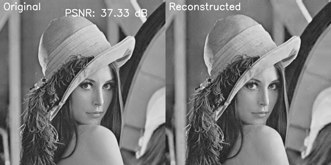
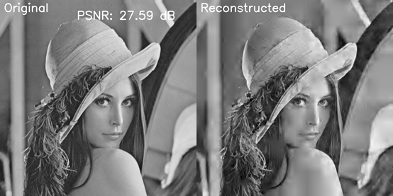

## Overview
This project is the final project of a course. It implements a simple image compression and communication system using wavelet transforms, quantization, entropy coding, and network transmission.

## Figures：
### 1.	R-D curves of the test image:

It can be seen that smaller quantization steps require more bitrate, but gets higher PSNR (better image quality).

### 2.	Comparison of original and reconstructed images:

Quantization step size = 8.0

 

Quantization step size = 32.0

